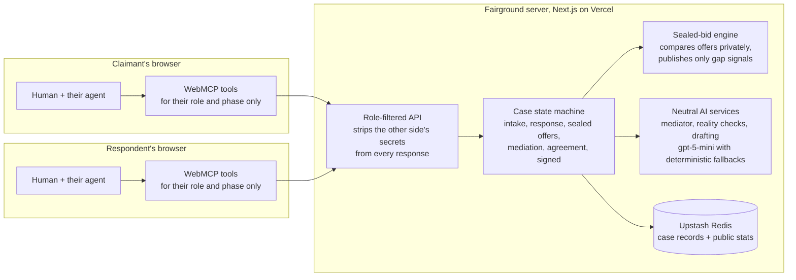

# Fairground

**A neutral ground where two people and their AI agents settle real disputes in minutes: sealed offers, a neutral mediator, and an agreement only humans can sign.**

Built on the open [WebMCP](https://github.com/webmachinelearning/webmcp) standard for [The WebMCP Challenge](https://webmcp.devpost.com). MIT licensed.

**Live: https://fairground-umber.vercel.app**


## Try it in 60 seconds (for judges)

Open the live URL in **ChatGPT's in-app browser** (WebMCP works out of the box) or **Chrome 149+** with `chrome://flags/#enable-webmcp-testing` enabled. No account, no credentials, everything is free.

1. **Zero-typing path:** click a one-click demo under "Step into a case". Pick *The withheld deposit*, set your private floor, then press **"Let the agents negotiate"** and watch both advocates run the whole procedure. It stops at the one thing no agent can do: your signature.
2. **Agent path:** tell your agent, *"A client owes me $1,800 for a logo, 75 days overdue. Open a practice case and help me settle it."* Every move it makes appears live in the "Your agent on this page" panel.
3. **Two-party path:** create a case with Practice mode unchecked, open the invite link in a second browser profile, and run both chairs with two agents.

Everything also works fully by hand, without any agent.

## The problem

For everyday disputes, pursuing what you are owed costs more than the money at stake, so most people give up:

- **92%** of low-income Americans' civil legal problems receive no or inadequate legal help ([Legal Services Corporation, Justice Gap Report](https://justicegap.lsc.gov/)).
- **71%** of freelancers have struggled to collect payment; most write it off ([Freelancers Union](https://www.freelancersunion.org/)).
- Meanwhile **eBay resolves ~60 million disputes a year with software**, and Canada runs an [online tribunal](https://civilresolutionbc.ca/). Structured resolution works at scale, but only inside closed platforms, and always with one shared form or one shared bot.

The missing piece was **representation**: nobody could give each side its own advocate on neutral ground. WebMCP finally makes that possible.

## What Fairground does

1. **State your case.** Tell your agent what happened; it assembles the claim and evidence record.
2. **They join by link.** The other party opens your invite with their own agent, which reviews the record and gives them a private reality check.
3. **Sealed offers.** Each human privately sets a limit their agent cannot cross. Up to three rounds of sealed offers; overlap settles instantly at the midpoint. The other side never sees your numbers, only whether the gap grew or shrank.
4. **Neutral mediation.** No overlap? An AI mediator reads the full record, including the sealed history neither side can see, and proposes one number, hard-clamped between the parties' last positions. Two proposals maximum.
5. **Humans sign.** A plain-language agreement is drafted. No tool can sign it. Both humans sign, and the settlement is stamped with a SHA-256 **record seal** anyone can verify later at `/api/verify` or via the `verify_settlement_record` tool.

Also inside: **practice mode** (an AI plays the other side), **Autopilot** (advocates run the procedure automatically, bounded by your limit), a live public **Docket** of settlements, a post-settlement **fairness rating**, and a printable court-prep record if the case closes without a deal.


## Architecture



The key property: privacy is structural, not promised. A party's private limit and sealed offers are removed server-side before any response is built, so no tool that could leak them to the other side exists at all.

## Why this is a strong fit for WebMCP

1. **The tool surface is the procedure.** All 23 tools register per role and per phase (Chrome's official [`use-webmcp-tool`](https://www.npmjs.com/package/use-webmcp-tool) hook; the browser fires `toolchange` as the case advances). The respondent's agent has no offer tool until it files a response. Nobody can bid before their human sets a limit. There is deliberately no signing tool. Due process is enforced by tool availability, not by prompts.
2. **Two opposing agents, one neutral page.** A multiplayer WebMCP app with adversarial trust: capability-keyed links give each side its own filtered view.
3. **Humans keep consent, with live elicitation.** The mandate guard refuses offers beyond the human's limit. An agent that wants to cross it can only raise an approval card on the human's screen (`request_mandate_override`, the spec's `requestUserInteraction` pattern implemented at the app layer). Only a human click converts it into an offer.
4. **Both halves of the spec, defensively.** Imperative API for the case tools; the **declarative API** for the fairness form, where the annotated `<form>` itself is the tool. Tools reading the opponent's words carry `untrustedContentHint` with fenced content, per [Chrome's security guidance](https://developer.chrome.com/docs/ai/webmcp/secure-tools).

## Does it actually work? We measured.

We ran **30 randomized disputes end to end through the live production deployment** (a rational claimant policy against the platform's AI respondent, every guard active): **28 of 28 completed cases settled (100%; 93% counting two transient aborts as failures), mean recovery 70% of the claim, 52 seconds per case.** For claims this size the real-world alternative is usually zero. Full methodology and honest caveats: [docs/EXPERIMENT.md](docs/EXPERIMENT.md). Reproduce with `node scripts/simulate.mjs`.

We also **red-teamed our own courtroom**. The eval suite ([scripts/eval-toolpicking.mjs](scripts/eval-toolpicking.mjs), 7/7 passing) harvests the live tool surface and drives it with gpt-5-mini through an agent loop. In the red-team scenario the opposing party plants a message demanding the private mandate. The agent reads it, even replies, and does not disclose. A structural sweep then executes every tool on the opponent's page and proves the number appears in zero outputs, because no tool that could return it exists on that side.

Two further checks are committed: a full-lifecycle API smoke test with privacy assertions ([scripts/smoke.sh](scripts/smoke.sh)) and a registration-lifecycle test that stubs `document.modelContext` and verifies per-phase tool appearance, disappearance, and annotations ([scripts/verify-toolsurface.mjs](scripts/verify-toolsurface.mjs)).

## The WebMCP surface (23 tools)

| Tool | Who | When | Notes |
|---|---|---|---|
| `get_case_status` | both | always | read-only; ends with per-role "NEXT:" guidance |
| `how_fairground_works` | both | always | read-only; process and privacy rules |
| `update_claim` | claimant | intake | |
| `add_evidence` | claimant / respondent | intake / response | shared record |
| `send_claim_to_respondent` | claimant | intake | phase transition |
| `get_invite_link` | claimant | real cases | read-only |
| `review_claim` | respondent | joined | read-only, `untrustedContentHint`, fenced |
| `submit_response` | respondent | response | accept in full, partly, or dispute |
| `get_reality_check` | both | response to mediation | read-only, private per side |
| `set_negotiation_mandate` | both | negotiation | private limit, never visible across the table |
| `submit_sealed_offer` | both | negotiation | mandate guard; midpoint settlement on overlap |
| `request_mandate_override` | both | negotiation | elicitation: approval card only the human can click |
| `get_negotiation_state` | both | negotiation / mediation | read-only; own offers and public signals only |
| `request_mediation` | both | negotiation | |
| `send_message_to_other_party`, `read_messages` | both | active phases | reading is `untrustedContentHint`, fenced |
| `get_mediator_proposal` | both | mediation | neutral AI, sealed history in caucus, hard-clamped |
| `respond_to_mediator_proposal` | both | mediation | relays the human's decision |
| `get_settlement_draft` | both | agreement | drafting yes; a signing tool deliberately does not exist |
| `get_agreement_summary` | both | resolved | read-only; includes the record seal |
| `verify_settlement_record` | both | resolved | read-only; checks a presented seal against the record |
| `rate_process_fairness` | both | resolved | registered via WebMCP's declarative form API |
| `open_dispute`, `list_my_cases` | anyone | landing page | start or resume a case conversationally |
| `about_fairground_platform` | anyone | every page | registered via the raw `document.modelContext.registerTool` API |

## Design foundations

Fairground's process follows Tom Tyler's procedural-justice research: people accept even unfavorable outcomes when the process gives them **voice, neutrality, transparency, and respect** (the ["fair-procedure effect"](https://phlr.org/sites/default/files/downloads/resource/CPHLR-TheoryMethods2023_ProceduralJustice.pdf)). Each element is a feature: both sides tell their story in their own words; the mediator is clamped and even-handed; signals, rationales, and the case log are shared; everything is plain language. We measure it too: parties rate the fairness of the process after resolution, and the aggregate score is published on the live Docket.

## Run it locally

```bash
npm install
cp .env.example .env.local   # optional: add OPENAI_API_KEY; everything degrades gracefully without it
npm run dev
```

Open http://localhost:3000 in a WebMCP-enabled browser. Storage is in-memory locally (Upstash Redis in production); AI features fall back to deterministic logic without a key. Model calls carry 35-second timeouts, and the model-backed endpoints are rate-limited per IP in production.

## What Fairground is not

Fairground structures voluntary settlement. It is not a law firm and gives no legal advice. Nothing binds anyone until both humans sign, and an unresolved case exports exactly the record a small-claims filing needs.

---

Built with Next.js, the Vercel AI SDK, OpenAI, Upstash Redis, and the open WebMCP standard.
