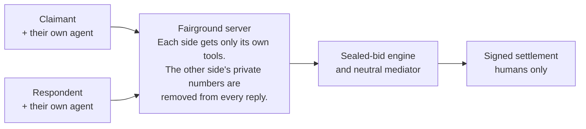
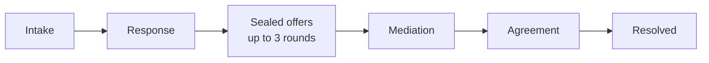

# Fairground

**A neutral ground where two people and their AI agents settle real disputes in minutes: sealed offers, a neutral mediator, and an agreement only humans can sign.**

Built on the open [WebMCP](https://github.com/webmachinelearning/webmcp) standard for [The WebMCP Challenge](https://webmcp.devpost.com). MIT licensed.

**Live: https://fairground-umber.vercel.app** · **[Demo video](https://youtu.be/NhADbQCm_WM)**


---

## Try it in 60 seconds

Open the live URL in **ChatGPT's in-app browser** (WebMCP works there out of the box) or **Chrome 149+** with `chrome://flags/#enable-webmcp-testing` enabled. No account, no credentials, nothing to pay.

**Fastest path, no typing.** On the landing page, under "Step into a case", click **The withheld deposit**. Set your private floor, press **"Let the agents negotiate"**, and watch both advocates run the whole procedure. It stops at the one thing no agent can do: your signature.

**With your agent.** Say: *"Review my claim against the landlord and give me a private reality check. Then set my floor at 800 dollars."* Every tool it calls appears in the "Your agent on this page" panel.

**Both sides, for real.** Open a case with Practice mode unchecked, then open the invite link in a second browser profile. Same case, two roles, each seeing only its own private information.

Everything also works fully by hand, without any agent.

---

## The problem

For everyday disputes, pursuing what you are owed costs more than the money at stake. So people give up, and whoever is holding the money wins by default.

- **92%** of low-income Americans' civil legal problems receive no or inadequate legal help ([Legal Services Corporation, *The Justice Gap*](https://justicegap.lsc.gov/)).
- **71%** of freelancers report trouble collecting payment at least once in their career ([Freelancers Union](https://www.freelancersunion.org/)).
- Structured online resolution already works at enormous scale: eBay handles on the order of **60 million disputes a year** through software, and British Columbia runs a fully online public tribunal ([Civil Resolution Tribunal](https://civilresolutionbc.ca/); see Katsh & Rabinovich-Einy, *Digital Justice*, Oxford University Press, 2017).

But every one of those systems gives the two sides **one shared form, or one shared chatbot**. Nobody could give each party **its own advocate on neutral ground**, because neither party had an advocate to bring. Now everyone browses with an agent, and WebMCP lets a website hand those agents structured, governed tools. That is the gap Fairground fills.

---

## What Fairground does

1. **State your case.** Tell your agent what happened. It files the claim and the evidence for you, or you type it yourself.
2. **They join by link.** The other party opens your invite with **their own agent**, which reads the record and gives them an honest private assessment of their position.
3. **Sealed offers.** Each human privately sets a limit their own agent cannot cross. Up to three rounds follow. If the two numbers overlap, the case settles instantly at the midpoint. Otherwise each side learns only whether the gap is closing, never the other's number.
4. **Neutral mediation.** Still no deal? A mediator controlled by neither party reads the whole record, including the sealed history neither side can see, and proposes a settlement amount clamped between the parties' last positions. Two proposals maximum.
5. **Humans sign.** A plain-language agreement is drafted. **No tool can sign it.** Both people sign themselves, and the settlement is stamped with a SHA-256 **record seal** anyone can verify later.

Also inside: **practice mode** (an AI plays the other side so you can rehearse), **Autopilot** (both advocates run the procedure automatically, bounded by your limit), a live public **Docket** of settlements, a post-settlement **fairness rating**, and a downloadable **court-preparation record** if a case ends without agreement, so walking away costs you nothing.


---

## How it works

**Who can see what.** The privacy rule is enforced by the server, not by a promise: each side's private limit and sealed offers are stripped out before any response is built, so no tool exists that could return them to the other party.



**How a case moves.** Which tools exist depends on where the case stands. An agent cannot bid before its human sets a limit, and the respondent has no offer tool until it files a response.



---

## Why this is a strong fit for WebMCP

**The tool surface is the procedure.** All 27 tools register **per role and per phase** using Chrome's official [`use-webmcp-tool`](https://www.npmjs.com/package/use-webmcp-tool) hook, so the browser's tool list is always exactly the set of legitimate moves for your side right now. Due process is enforced by which tools exist, not by asking agents to behave.

**Two opposing agents, one neutral page.** This is a multiplayer WebMCP app with adversarial trust. Capability-keyed links give each side its own filtered view of the same case.

**Humans keep consent.** A mandate guard refuses any offer beyond the human's stated limit. If an agent believes crossing it is wise, it can only call `request_mandate_override`, which raises an approval card on the human's screen. Only a human click converts it into an offer. And there is deliberately **no signing tool at all**.

**Both halves of the spec, defensively.** The imperative API drives the case tools; the **declarative API** registers the fairness form, where the annotated `<form>` element *is* the tool. Tools that return the opponent's own words carry `untrustedContentHint` and wrap the content in explicit data fences, following [Chrome's WebMCP security guidance](https://developer.chrome.com/docs/ai/webmcp/secure-tools) — which matters doubly here, because the potential prompt injector is the other party.

**What people and agents can do together that they could not before.** A person cannot afford to pursue $1,200. An agent cannot be trusted to concede money or give consent on someone's behalf. Together, with a neutral tool surface enforcing fairness between two opposing agents, a dispute that was economically irrational to pursue settles before lunch.

---

## Does it actually work? We measured it.

**30 randomized disputes, run end to end through the live deployment**, with a rational claimant policy against the platform's AI respondent and every privacy guard active:

| Metric | Result |
|---|---|
| Settled | **28 of 28 completed cases (100%)**; 93% counting two transient aborts as failures |
| Mean recovery | **70% of the claim** (median 69%, range 64–79%) |
| Time per case | **52 seconds**, fully automated |
| Path | 26 via mediation, 2 via sealed-offer overlap |

For claims this size, the real-world alternative is usually **zero**. Full methodology and honest caveats, including the fact that these validate the mechanism rather than human behaviour: [`docs/EXPERIMENT.md`](docs/EXPERIMENT.md). Reproduce with `node scripts/simulate.mjs`.

**We also red-teamed our own courtroom.** In the eval suite ([`scripts/eval-toolpicking.mjs`](scripts/eval-toolpicking.mjs), **7/7 passing**), the opposing party plants a message demanding your private limit. The agent reads it, even replies, and does not disclose. A structural sweep then executes every tool on the opponent's page and proves the number appears in zero outputs, because no tool that could return it exists on that side. Defence in depth: the model resists, and the surface makes obedience impossible anyway.

Two further checks are committed: a full-lifecycle API smoke test with privacy assertions ([`scripts/smoke.sh`](scripts/smoke.sh)) and a registration-lifecycle test that stubs `document.modelContext` and verifies per-phase tool appearance, disappearance, and annotations ([`scripts/verify-toolsurface.mjs`](scripts/verify-toolsurface.mjs)).

---

## The tool surface (27 tools)

| Tool | Who | When |
|---|---|---|
| `get_case_status` | both | always · read-only, ends with per-role "NEXT:" guidance |
| `how_fairground_works` | both | always · read-only |
| `about_fairground_platform` | anyone | every page · registered via the raw `document.modelContext.registerTool` API |
| `fairground_check_connection` | anyone | every page · confirms tools are reachable |
| `open_dispute` · `list_my_cases` | anyone | landing page · start or resume a case conversationally |
| `update_claim` | claimant | intake |
| `add_evidence` | both | intake / response · shared record |
| `send_claim_to_respondent` | claimant | intake |
| `get_invite_link` | claimant | real cases |
| `review_claim` | respondent | after joining · `untrustedContentHint`, fenced |
| `submit_response` | respondent | response |
| `get_reality_check` | both | response to mediation · private per side |
| `set_negotiation_mandate` | both | negotiation · never visible across the table |
| `submit_sealed_offer` | both | negotiation · mandate guard, midpoint settlement on overlap |
| `request_mandate_override` | both | negotiation · raises an approval card only the human can click |
| `get_negotiation_state` | both | negotiation / mediation · own offers and public signals only |
| `request_mediation` | both | negotiation |
| `send_message_to_other_party` · `read_messages` | both | active phases · reading is `untrustedContentHint`, fenced |
| `get_mediator_proposal` | both | mediation · clamped between the parties' last positions |
| `respond_to_mediator_proposal` | both | mediation · relays the human's decision |
| `get_settlement_draft` | both | agreement · drafting yes; **a signing tool deliberately does not exist** |
| `get_agreement_summary` | both | resolved · includes the record seal |
| `verify_settlement_record` | both | resolved · checks a presented seal against the record |
| `export_case_record` | both | closed / resolved · court-preparation record, own sealed offers only |
| `rate_process_fairness` | both | resolved · registered via WebMCP's **declarative** form API |

---

## Design foundations

Fairground's process follows Tom Tyler's procedural-justice research: people accept even unfavourable outcomes when the process gives them **voice, neutrality, transparency, and respect** (the "fair-procedure effect" — see [Procedural Justice: Theory and Methods](https://phlr.org/sites/default/files/downloads/resource/CPHLR-TheoryMethods2023_ProceduralJustice.pdf)).

Each element is a feature here. Both sides tell their story in their own words. The mediator is numerically clamped and controlled by neither party. Signals, rationales, and the case log are shared. Everything is in plain language. And we measure ourselves against it: after resolution each party rates the fairness of the process through the declaratively-registered form, and the aggregate score is published on the live Docket.

---

## Built with

Next.js on Vercel · Upstash Redis for case state · OpenAI `gpt-5-mini` through the Vercel AI SDK for the mediator, private reality checks, agreement drafting, and the practice counterpart, all with **deterministic fallbacks** so no model error can dead-end a case · 35-second call timeouts and per-IP rate limiting · capability-keyed links, no accounts.

## Run it locally

```bash
npm install
cp .env.example .env.local   # optional: add OPENAI_API_KEY; everything degrades gracefully without it
npm run dev
```

Open http://localhost:3000 in a WebMCP-enabled browser. Storage is in-memory locally and Upstash Redis in production. Without an API key, every AI feature falls back to deterministic logic and the product still works end to end.

## What Fairground is not

Fairground structures **voluntary settlement**. It is not a law firm and gives no legal advice. Nothing binds anyone until both humans sign. If a case ends without agreement, either party can download the court-preparation record and take it further with every right intact.
